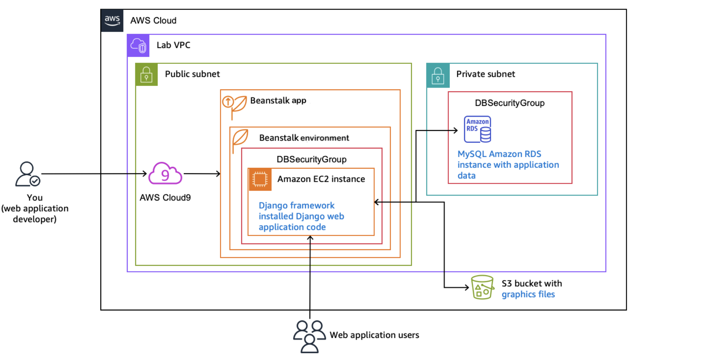
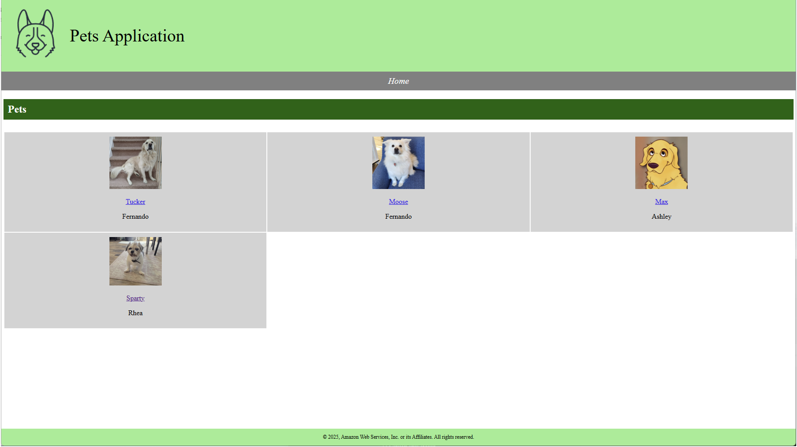
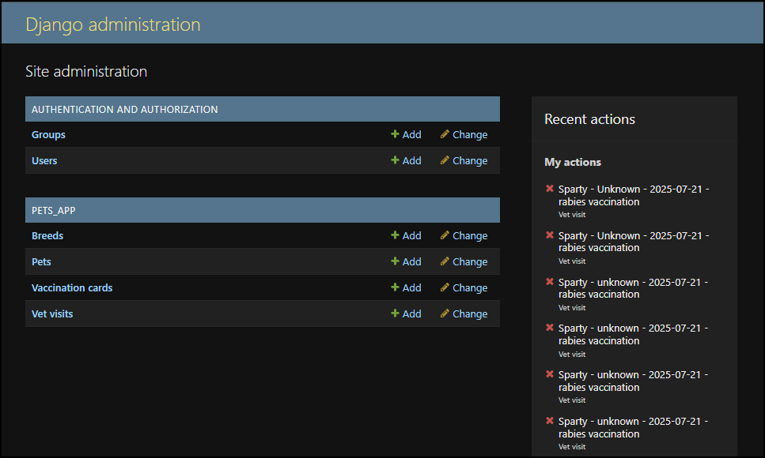
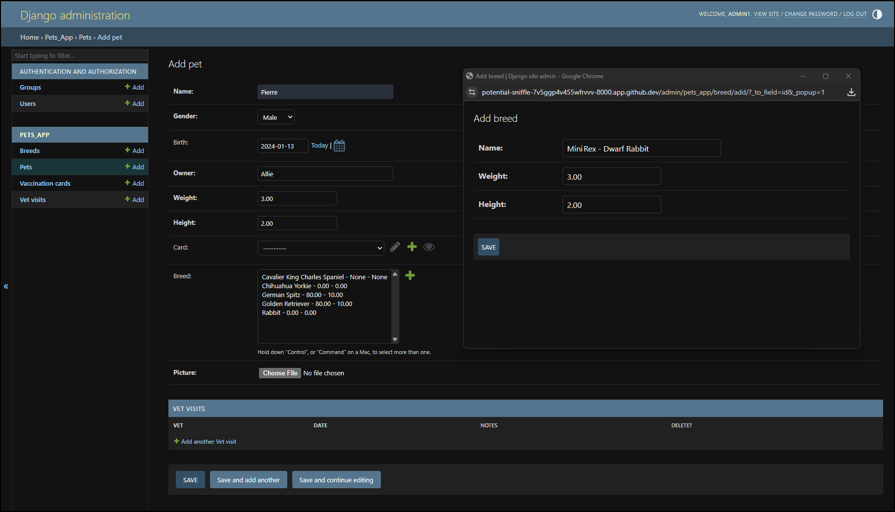
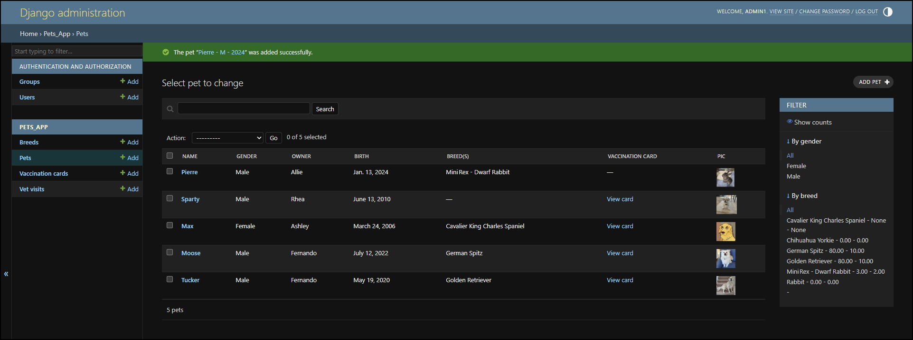
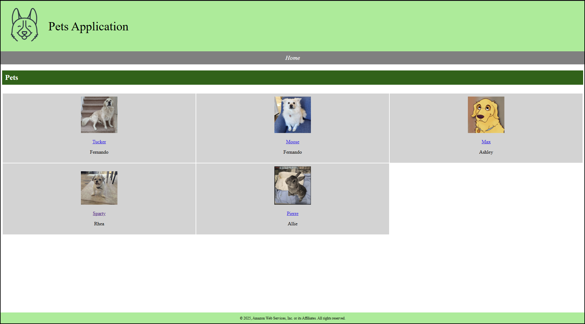

# Pets Application – Django 5.2

# Project Overview
 The Pets Application is a learning project that demonstrates a full Django CRUD workflow—creating, reading, updating, and deleting pets and their veterinary records—then deploys the stack to AWS using Elastic Beanstalk and RDS.

 The application is designed to run on AWS infrastructure, utilizing services such as RDS for the database and S3 for static file storage.


## Prerequisites

| Tool       | Version | Notes                                 |
| ---------- | ------- | ------------------------------------- |
| Python     | 3.12    | Confirm with `python --version`       |
| pip        | ≥23     | `python -m pip install --upgrade pip` |
| virtualenv | any     | or `python -m venv`                   |
| AWS CLI    | 2.x     | `aws configure` set default profile   |
| EB CLI     | 3.x     | `pip install awsebcli`                |
| Git        | ≥2.30   |                                       |

---

## Repository Structure 

```
Pets_Application/
├── django/
│   ├── hello_app/               # sample landing app
│   │   ├── views.py
│   │   └── urls.py
│   ├── pets_app/                # main CRUD app
│   │   ├── migrations/
│   │   ├── templates/pets_app/
│   │   ├── admin.py
│   │   ├── models.py
│   │   ├── tests.py
│   │   └── views.py
│   ├── pets_project/
│   │   ├── settings.py
│   │   ├── urls.py
│   │   ├── wsgi.py
│   │   └── __init__.py
│   ├── manage.py
│   └── requirements.txt
├── media/                       # uploaded pet photos (dev)
├── static/                      # Tailwind CSS build output
├── .ebextensions/               # EB config files (prod only)
└── README.md                    # ← you are here
```

### Important Integration Points:

- **Database:** MySQL database hosted on Amazon RDS

- **Static Files:** Stored on Amazon S3

### Infrastructure

The application utilizes the following AWS resources:
- **EC2:** Hosts the Django application

- **RDS:** MySQL database for storing pet info(owner,breed,name,weight,height,vet visits,vaccinations.) 

- **S3:** Stores static files and media uploads

- **Elastic Beanstalk:** Manages the application deployment and scaling

## Architecture Diagram



This diagram illustrates the high-level AWS architecture of the Django Pets Application. It shows how the different AWS services (EC2, RDS, S3, and Elastic Beanstalk) interact with the Django application to provide a scalable and robust card platform for pet information. 

---

## Local Development

```bash
# clone & enter repo
$ git clone https://github.com/Levi-Breedlove/Pets_Application.git

# django directory
$ cd django

# create virt‑env
$ python -m venv .venv && source .venv/bin/activate

# install deps
$ pip install -r requirements.txt  # Django 5.2, pillow, mysqlclient (optional)

# prepare data migrations
python manage.py makemigrations

# migrations, sample data 
$ python manage.py migrate

# (Optional) load starter data
$ python manage.py loaddata savedata.json  # located in django/fixtures/

# run Tailwind build (if used)
$ npx tailwindcss -i ./static/src.css -o ./static/styles.css --watch &

# launch dev server
$ python manage.py runserver

# create user for admin console
$ python manage.py createsuperuser
```
Open [http://127.0.0.1:8000](http://127.0.0.1:8000) for the public site and `/admin` for the admin console.

### The Website Loads With Pet Card Fixtures:


- SQL query to verify the **Pets Table** has loaded:
  ```
  sqlite3 db.sqlite3 -header -column \
  "SELECT id, name, owner, birth FROM pets_app_pet LIMIT 5;"
  ```

## Accessing the Django Admin Console

**To manage your pet cards, owners, pet visits, vaccination records and users via Django’s built-in admin interface, follow these steps:**

1. Create a Superuser:
   - Run this from the `django/` directory
     ```
     python manage.py createsuperuser
     ```
   - You’ll be prompted to enter a username, email address and password.

2. Start the Development Server:
   ```
   python manage.py runserver
   ```

3. Sign In to the Admin Console:
   - Open your browser at
     http://localhost:8000/admin/


4. Once signed in, you’ll see the following sections in the admin dashboard:
     - **Authentication and Authorization**
        - **Groups**  — create, edit or delete user groups.
        - **Users**  — manage site users and their permissions.

     - **Pets-App**
        - **Breeds** — view, add, edit or delete pet breeds.
        - **Pets** — browse, create and edit pet profiles.
        - **Vaccination Records** — add, update or remove vaccination cards.
        - **Vet Visits** — record and review veterinary visits for each pet. 

     - **Recent actions**  — quick link to edits you’ve made most recently.

       

## Demo: Adding a Pet Card

1. Log in to the admin at `http://localhost:8000/admin/` with your superuser credentials.  

2. Under **Pets-APP**, click **Pets ➔ Add**  

3. Fill out the form:

4. We'll need to add a **Breed** to register the pet as and upload a photo:
   
   

5. Click **Save**.  

6. You’ll now see **Pierre** listed under **Pets** – you can click the **ID** number to edit it anytime.

   
   

 


## Pets Application – AWS Deployment Guide (Elastic Beanstalk + S3 + RDS)


## Prerequisites

- AWS Account
- IAM user with Elastic Beanstalk, EC2, RDS, and S3 permissions
- Python 3.11+ and virtual environment
- EB CLI installed → [Install Guide](https://docs.aws.amazon.com/elasticbeanstalk/latest/dg/eb-cli3-install.html)

---

## Project Setup

### 1. Clone and Prepare
```bash
git clone https://github.com/your-username/Pets_Application.git
cd Pets_Application-main/django
python -m venv .venv
source .venv/bin/activate
pip install -r requirements.txt
```

### 2. Ensure These Files Exist
- `requirements.txt`
- `manage.py`
- `Procfile` → `web: gunicorn pets_project.wsgi`
- `.ebextensions/django.config`

---

### 3. Install EB CLI into the venv
```bash
pip install awsebcli
eb --version
```

## Deploying with Elastic Beanstalk

### 1. Initialize EB
```bash
eb init -p python-3.11 pets-app --region us-west-2
```

### 2. Create Environment
```bash
eb create pets-env --database.engine mysql
```

---

## Set Environment Variables

Via EB CLI:
```bash
eb setenv USE_SQLITE=0 DB_NAME=pets DB_USER=django DB_PASSWORD=yourpassword \
DB_HOST=your-rds-endpoint.amazonaws.com DB_PORT=3306 DJANGO_SECRET_KEY=yourkey USE_S3=0
```
---

## Amazon RDS (MySQL)

1. Go to **RDS > Create Database**
2. Choose:
   - MySQL
   - Free Tier
   - DB name: `pets`
   - Username: `django`, password: `yourpassword`
3. Enable public access or allow EB security group

---

## Optional: Amazon S3 for Static/Media Files

1. Create S3 bucket
2. Set `USE_S3=1` in EB environment
3. Assign correct IAM permissions to EB role

---

## Create Admin User

```bash
eb ssh
source /var/app/venv/*/bin/activate
cd /var/app/current
python manage.py createsuperuser
```

Access: `https://your-env.elasticbeanstalk.com/admin/`

---

## EB Extensions

`.ebextensions/django.config` handles setup:

```yaml
commands:
  01_migrate:
    command: "source /var/app/venv/*/bin/activate && python manage.py migrate --noinput"
  02_collectstatic:
    command: "source /var/app/venv/*/bin/activate && python manage.py collectstatic --noinput"
```

---

## Post-Deployment Checklist

## Required Code Changes & Files

### 🔧 1. `pets_project/settings.py` Updates

Ensure these environment-based configurations exist:

```python
import os

SECRET_KEY = os.getenv("DJANGO_SECRET_KEY", "dev-insecure-key")
DEBUG = os.getenv("DJANGO_DEBUG", "1") == "1"
```

#### Environment-Based Database Switching

```python
if os.getenv("USE_SQLITE", "1") == "1":
    DATABASES = {
        "default": {
            "ENGINE": "django.db.backends.sqlite3",
            "NAME": BASE_DIR / "db.sqlite3",
        }
    }
else:
    DATABASES = {
        "default": {
            "ENGINE": "django.db.backends.mysql",
            "NAME": os.getenv("DB_NAME", "pets"),
            "USER": os.getenv("DB_USER", "django"),
            "PASSWORD": os.getenv("DB_PASSWORD", ""),
            "HOST": os.getenv("DB_HOST", "localhost"),
            "PORT": os.getenv("DB_PORT", "3306"),
            "OPTIONS": {"init_command": "SET sql_mode='STRICT_TRANS_TABLES'"},
        }
    }
```

---

### `.ebextensions/django.config`

Ensure this file exists in `django/.ebextensions/`:

```yaml
option_settings:
  aws:elasticbeanstalk:container:python:
    WSGIPath: pets_project.wsgi:application

commands:
  01_migrate:
    command: "source /var/app/venv/*/bin/activate && python manage.py migrate --noinput"
  02_collectstatic:
    command: "source /var/app/venv/*/bin/activate && python manage.py collectstatic --noinput"
```

Optionally inject environment variables in the same config or through EB CLI/Console:

```yaml
  DJANGO_SECRET_KEY: your-secret-key
  USE_SQLITE: "0"
  DB_NAME: pets
  DB_USER: django
  DB_PASSWORD: your-password
  DB_HOST: your-rds-endpoint.amazonaws.com
  DB_PORT: "3306"
```

---

### Django Project Root Files (`/django/` folder)

#### `Procfile`

```procfile
web: gunicorn pets_project.wsgi
```

#### `requirements.txt`

Ensure it includes the following packages:

```
Django>=4.0,<5.0
gunicorn
mysqlclient
```

---

### GitHub/Collaboration Setup

Ensure your repository includes:

```
/django
  ├── manage.py
  ├── .ebextensions/django.config
  ├── requirements.txt
  ├── Procfile
  ├── pets_project/settings.py
```

This will let users clone and deploy:

```bash
python -m venv .venv
source .venv/bin/activate
pip install -r requirements.txt
eb init
eb create
eb deploy
```

---

#### `.ebignore` – prevents unnecessary files from being uploaded

```
.venv/
*.pyc
__pycache__/
db.sqlite3
media/
html2/
```

#### `.env.example` – helps other developers set up environment variables

```env
DJANGO_SECRET_KEY=replace-me
USE_SQLITE=0
DB_NAME=pets
DB_USER=django
DB_PASSWORD=yourpassword
DB_HOST=your-rds-endpoint.amazonaws.com
DB_PORT=3306
```

---
### Summary of Files to Commit

| File | Purpose |
|------|---------|
| `Procfile` | Informs EB how to run Django |
| `.ebextensions/django.config` | Handles migration and static collection |
| `requirements.txt` | Includes gunicorn and MySQL support |
| `settings.py` | Supports env-based config switching |
| `.ebignore` | Optimizes deployments |
| `.env.example` | Helps teammates set up env vars |

---

# Potential Implementations – Pets Application
The current Pets Application offers core features for pet record management via the Django admin. But there are major opportunities to expand this into a full-fledged **Pet Club community portal**:

## User Features to Add 

**User Registration & Login**
- Implement Django's built-in auth system or integrate with Amazon Cognito for scalable, cloud-native identity management and multi-factor authentication (MFA).
    
**User Profiles with Pet Cards** 
- Extend the User model via a custom profile (e.g. OneToOneField) to associate users with multiple pets. Store images using Amazon S3 for reliable media hosting and secure URL expiration.

**Forum or Club Wall** 
- Build a simple forum using Django models and templates. For future scalability, consider migrating discussions to Amazon DynamoDB with a Lambda-backed API or integrating Amazon Q Business for AI-powered user interactions.

**Photo Gallery Uploads** 
- Allow pet owners to upload and tag photos. Use AWS S3 with boto3 to manage secure uploads, and Amazon Rekognition for potential image classification or content moderation.

**Pet Matching or Friend System** 
- Create user relationships (e.g. followers/friends) using a many-to-many model. For more advanced matching, integrate Amazon Personalize for recommendation systems.

**Search and Filter System** 
- Enable breed, age, or status filters using Django QuerySets. For scale and performance, integrate Amazon OpenSearch Service to offload full-text search and filtering.

## Communication Features

**Email Notifications** 
- Send appointment or event alerts via Django’s EmailBackend or offload to Amazon SES (Simple Email Service) for high deliverability and production-ready email flows.

**Admin-to-User Messaging** 
- Build a simple internal messaging system, and integrate Amazon SNS (Simple Notification Service) for real-time push notifications or email alerts to specific users or topics.

**Pet Adoption Inquiry Forms** 
- Allow users to express interest in pets. Use Django forms + views, then optionally integrate with AWS Step Functions or Lambda for a vetting/approval workflow.

## Technical Improvements

**Frontend Styling Upgrade** 
- Migrate from default templates to Tailwind CSS or Bootstrap for modern UI. Consider React for dynamic interactions and use Amazon CloudFront for global delivery of static assets.

**Responsive Design** 
- Ensure all layouts are mobile-friendly with media queries and grid systems. Test using Amazon Device Farm for cross-device compatibility.

**Test Coverage** 
- Write unit and integration tests with pytest-django. Automate tests in GitHub Actions and deploy to Elastic Beanstalk only if tests pass.

**Security Hardening**  
  - Enforce HTTPS-only using Elastic Load Balancer (ELB).
  - Store secrets in AWS Systems Manager Parameter Store or Secrets Manager.
  - Enable CSRF protection, password validators, and session expiration settings in Django.
  - Apply IAM-based access restrictions for media or storage buckets.

---

© 2025 Levi Breedlove – MIT License Amazon Web Services 

