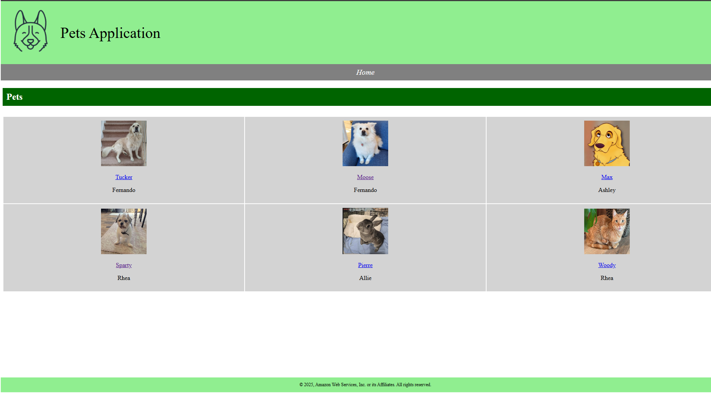
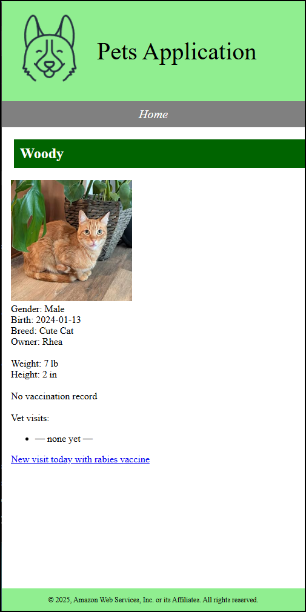

# Pets Application – Django 5.2

# Project Overview
 The Pets Application is a learning project that demonstrates a full Django CRUD workflow—creating, reading, updating, and deleting pets and their veterinary records—then deploys the stack to AWS[...]

 The application is designed to run on AWS infrastructure, utilizing services such as RDS for the database and S3 for static file storage.


## Prerequisites

| Tool       | Version | Notes                                 |
| ---------- | ------- | ------------------------------------- |
| Python     | 3.12    | Confirm with `python --version`       |
| pip        | ≥23     | `python -m pip install --upgrade pip` |
| virtualenv | any     | or `python -m venv`                   |
| AWS CLI    | 2.x     | `aws configure` set default profile   |
| EB CLI     | 3.x     | `pip install awsebcli`                |
| Git        | ≥2.30   |                                       |

---

## Repository Structure 

```
Pets_Application/
├── django/
│   ├── hello_app/               # sample landing app
│   │   ├── views.py
│   │   └── urls.py
│   ├── pets_app/                # main CRUD app
│   │   ├── migrations/
│   │   ├── templates/pets_app/
│   │   ├── admin.py
│   │   ├── models.py
│   │   ├── tests.py
│   │   └── views.py
│   ├── pets_project/
│   │   ├── settings.py
│   │   ├── urls.py
│   │   ├── wsgi.py
│   │   └── __init__.py
│   ├── manage.py
│   └── requirements.txt
├── media/                       # uploaded pet photos (dev)
├── static/                      # Tailwind CSS build output
├── .ebextensions/               # EB config files (prod only)
└── README.md                    # ← you are here
```

## Important Integration Points:

- **Database:** MySQL database hosted on Amazon RDS

- **Static Files:** Stored on Amazon S3

## Infrastructure

The application utilizes the following AWS resources:
- **EC2:** Hosts the Django application

- **RDS:** MySQL database for storing pet info(owner,breed,name,weight,height,vet visits,vaccinations.) 

- **S3:** Stores static files and media uploads

- **Elastic Beanstalk:** Manages the application deployment and scaling

## Architecture Diagram


This diagram illustrates the high-level AWS architecture of the Django Pets Application. It shows how the different AWS services (EC2, RDS, S3, and Elastic Beanstalk) interact with the Django applicat[...]

---

## Local Development

```bash
# clone & enter repo
$ git clone https://github.com/Levi-Breedlove/Pets_Application.git

# django directory
$ cd django

# create virt‑env
$ python -m venv .venv && source .venv/bin/activate

# install deps
$ pip install -r requirements.txt  # Django 5.2, pillow, mysqlclient (optional)

# prepare data migrations
python manage.py makemigrations

# migrations, sample data 
$ python manage.py migrate

# (Optional) load starter data
$ python manage.py loaddata savedata.json  # located in django/fixtures/

# run Tailwind build (if used)
$ npx tailwindcss -i ./static/src.css -o ./static/styles.css --watch &

# launch dev server
$ python manage.py runserver

# create user for admin console
$ python manage.py createsuperuser
```
Open [http://127.0.0.1:8000](http://127.0.0.1:8000) for the public site and `/admin` for the admin console.

## The Website Loads With Pet Card Fixtures:


   - You can click a pet card to view information, of the pet, breed, owner, and vaccination records.
   - Demo button is included to mimic auto fill data for vaccine information upon visit/date.
   
     


- SQL query to verify the **Pets Table** has loaded:
  ```
  sqlite3 db.sqlite3 -header -column \
  "SELECT id, name, owner, birth FROM pets_app_pet LIMIT 5;"
  ```

## Accessing the Django Admin Console

**To manage your pet cards, owners, pet visits, vaccination records and users via Django's built-in admin interface, follow these steps:**

1. Create a Superuser:
   - Run this from the `django/` directory
     ```
     python manage.py createsuperuser
     ```
   - You'll be prompted to enter a username, email address and password.

2. Start the Development Server:
   ```
   python manage.py runserver
   ```

3. Sign In to the Admin Console:
   - Open your browser at
     http://localhost:8000/admin/


4. Once signed in, you'll see the following sections in the admin dashboard:
     - **Authentication and Authorization**
        - **Groups**  — create, edit or delete user groups.
        - **Users**  — manage site users and their permissions.

     - **Pets-App**
        - **Breeds** — view, add, edit or delete pet breeds.
        - **Pets** — browse, create and edit pet profiles.
        - **Vaccination Records** — add, update or remove vaccination cards.
        - **Vet Visits** — record and review veterinary visits for each pet. 

     - **Recent actions**  — quick link to edits you've made most recently.

       

## Demo: Adding a Pet Card

1. Log in to the admin at `http://localhost:8000/admin/` with your superuser credentials.  

2. Under **Pets-APP**, click **Pets ➔ Add**  

3. Fill out the form:

4. We'll need to add a **Breed** to register the pet as and upload a photo:
   
   

5. Click **Save**.  

6. You'll now see **Pierre** listed under **Pets** – you can click the **ID** number to edit it anytime.

   
   

 
## Pets Application – Comprehensive AWS Deployment Guide

This guide provides detailed instructions for deploying the Pets Application to AWS using Elastic Beanstalk, RDS for MySQL database, and S3 for static files.

### Prerequisites Setup Guide

Before deploying to AWS, you need to set up several tools and accounts. This section provides the essential setup steps needed for deployment.

#### 1. AWS Account Setup

1. **Create an AWS Account**:
   - Visit [AWS Sign Up](https://portal.aws.amazon.com/billing/signup)
   - Complete the registration process
   - After verification, you'll have access to the AWS Management Console

2. **Create an IAM User with Administrative Access**:
   - Log in to the [AWS Management Console](https://console.aws.amazon.com/)
   - Navigate to IAM (Identity and Access Management)
   - Create a new user with programmatic access
   - Attach the "AdministratorAccess" policy
   - Save the generated Access Key ID and Secret Access Key

#### 2. Install and Configure AWS CLI

```bash
# Install AWS CLI on Linux/macOS
curl "https://awscli.amazonaws.com/awscli-exe-linux-x86_64.zip" -o "awscliv2.zip"
unzip awscliv2.zip
sudo ./aws/install

# Verify installation
aws --version

# Configure AWS CLI with your credentials
aws configure
# Enter your Access Key ID when prompted
# Enter your Secret Access Key when prompted
# Enter your preferred region (e.g., us-west-2)
# Enter your preferred output format (json)
```

For other operating systems, visit the [AWS CLI installation guide](https://docs.aws.amazon.com/cli/latest/userguide/getting-started-install.html).

#### 3. Install EB CLI

```bash
# Install EB CLI using pip
pip install awsebcli

# Verify installation
eb --version
```

If you encounter permission issues, you may need to use:

```bash
pip install --user awsebcli
```

#### 4. Install Python 3.12+

```bash
# For Ubuntu/Debian
sudo apt update
sudo apt install -y software-properties-common
sudo add-apt-repository -y ppa:deadsnakes/ppa
sudo apt update
sudo apt install -y python3.12 python3.12-venv python3.12-dev

# Verify installation
python3.12 --version
```

#### 5. Install Git

```bash
# For Ubuntu/Debian
sudo apt update
sudo apt install -y git

# Verify installation
git --version
```

Now that you have all the prerequisites installed and configured, you're ready to proceed with deploying the Pets Application to AWS.

### Setting Up AWS Resources

#### 1. IAM Role Configuration

1. Navigate to the IAM console in AWS
2. Create a new role for Elastic Beanstalk with the following policies:
   - `AWSElasticBeanstalkWebTier`
   - `AWSElasticBeanstalkWorkerTier`
   - `AmazonS3FullAccess`
   - `AmazonRDSFullAccess`

#### 2. S3 Bucket Configuration

1. Create an S3 bucket for static files:
   ```bash
   aws s3 mb s3://pets-application-static --region your-region
   ```

2. Configure bucket permissions to allow public read access for static files:
   ```bash
   aws s3api put-bucket-policy --bucket pets-application-static --policy file://s3-policy.json
   ```

   Create a file named `s3-policy.json` with:
   ```json
   {
     "Version": "2012-10-17",
     "Statement": [
       {
         "Sid": "PublicReadGetObject",
         "Effect": "Allow",
         "Principal": "*",
         "Action": "s3:GetObject",
         "Resource": "arn:aws:s3:::pets-application-static/*"
       }
     ]
   }
   ```

3. Enable static website hosting:
   ```bash
   aws s3 website s3://pets-application-static --index-document index.html --error-document error.html
   ```

#### 3. RDS Database Setup

1. Create a parameter group for MySQL:
   ```bash
   aws rds create-db-parameter-group \
     --db-parameter-group-name pets-app-mysql \
     --db-parameter-group-family mysql8.0 \
     --description "Parameter group for Pets Application"
   ```

2. Create MySQL database:
   ```bash
   aws rds create-db-instance \
     --db-instance-identifier pets-app-db \
     --db-instance-class db.t3.micro \
     --engine mysql \
     --allocated-storage 20 \
     --master-username admin \
     --master-user-password YOUR_SECURE_PASSWORD \
     --vpc-security-groups YOUR_SECURITY_GROUP_ID \
     --db-parameter-group-name pets-app-mysql \
     --db-name petsapp
   ```

3. Note the endpoint URL from the output for your database configuration.

### Elastic Beanstalk Configuration

1. Navigate to your project directory:
   ```bash
   cd Pets_Application/django
   ```

2. Ensure you have the required files:
   - `requirements.txt` with all dependencies
   - `Procfile` with the content: `web: gunicorn pets_project.wsgi`

3. Create or update `.ebextensions/django.config`:
   ```yaml
   option_settings:
     aws:elasticbeanstalk:container:python:
       WSGIPath: pets_project.wsgi:application
     aws:elasticbeanstalk:environment:proxy:staticfiles:
       /static: static

   container_commands:
     01_migrate:
       command: "source /var/app/venv/*/bin/activate && python manage.py migrate --noinput"
       leader_only: true
     02_collectstatic:
       command: "source /var/app/venv/*/bin/activate && python manage.py collectstatic --noinput"
     03_createsu:
       command: "source /var/app/venv/*/bin/activate && python manage.py createsu"
       leader_only: true
   ```

4. Create a `.ebignore` file to exclude unnecessary files:
   ```
   .venv/
   *.pyc
   __pycache__/
   db.sqlite3
   media/
   html2/
   .DS_Store
   .git/
   .gitignore
   ```

5. Update your Django settings to support both local development and AWS deployment:

```python
# Settings for database
if os.getenv("USE_SQLITE", "1") == "1":
    DATABASES = {
        "default": {
            "ENGINE": "django.db.backends.sqlite3",
            "NAME": BASE_DIR / "db.sqlite3",
        }
    }
else:
    DATABASES = {
        "default": {
            "ENGINE": "django.db.backends.mysql",
            "NAME": os.getenv("DB_NAME", "pets"),
            "USER": os.getenv("DB_USER", "django"),
            "PASSWORD": os.getenv("DB_PASSWORD", ""),
            "HOST": os.getenv("DB_HOST", "localhost"),
            "PORT": os.getenv("DB_PORT", "3306"),
            "OPTIONS": {"init_command": "SET sql_mode='STRICT_TRANS_TABLES'"},
        }
    }

# Settings for static files
if os.getenv("USE_S3", "0") == "1":
    # AWS S3 settings
    AWS_STORAGE_BUCKET_NAME = os.getenv('AWS_STORAGE_BUCKET_NAME', 'pets-application-static')
    AWS_S3_CUSTOM_DOMAIN = f'{AWS_STORAGE_BUCKET_NAME}.s3.amazonaws.com'
    AWS_S3_OBJECT_PARAMETERS = {
        'CacheControl': 'max-age=86400',
    }
    AWS_LOCATION = 'static'
    STATIC_URL = f'https://{AWS_S3_CUSTOM_DOMAIN}/{AWS_LOCATION}/'
    STATICFILES_STORAGE = 'storages.backends.s3boto3.S3Boto3Storage'
    
    # Media files settings
    DEFAULT_FILE_STORAGE = 'pets_project.storage_backends.MediaStorage'
else:
    STATIC_URL = '/static/'
    STATIC_ROOT = os.path.join(BASE_DIR, 'static')
    MEDIA_URL = '/media/'
    MEDIA_ROOT = os.path.join(BASE_DIR, 'media')
```

6. Create a storage backend file `pets_project/storage_backends.py`:
```python
from storages.backends.s3boto3 import S3Boto3Storage

class MediaStorage(S3Boto3Storage):
    location = 'media'
    file_overwrite = False
```

### Deployment Process

1. Initialize Elastic Beanstalk in your project:
   ```bash
   eb init -p python-3.12 pets-application --region us-west-2
   ```
   Follow the prompts to select your region and application settings.

2. Create the Elastic Beanstalk environment:
   ```bash
   eb create pets-env
   ```

3. Set the required environment variables:
   ```bash
   eb setenv DJANGO_SECRET_KEY=your_secret_key \
     USE_SQLITE=0 \
     DB_NAME=petsapp \
     DB_USER=admin \
     DB_PASSWORD=YOUR_SECURE_PASSWORD \
     DB_HOST=your-rds-endpoint.rds.amazonaws.com \
     DB_PORT=3306 \
     USE_S3=1 \
     AWS_STORAGE_BUCKET_NAME=pets-application-static \
     AWS_ACCESS_KEY_ID=your_access_key \
     AWS_SECRET_ACCESS_KEY=your_secret_key
   ```

4. Deploy your application:
   ```bash
   eb deploy
   ```

5. Open your application:
   ```bash
   eb open
   ```

### Creating a Superuser on AWS

1. SSH into your Elastic Beanstalk instance:
   ```bash
   eb ssh
   ```

2. Activate the virtual environment and create a superuser:
   ```bash
   source /var/app/venv/*/bin/activate
   cd /var/app/current
   python manage.py createsuperuser
   ```

### Monitoring and Maintenance

1. View application logs:
   ```bash
   eb logs
   ```

2. Monitor application health:
   ```bash
   eb health
   ```

3. Scale your application:
   ```bash
   eb scale 2  # Scale to 2 instances
   ```

4. Update your application:
   - Make changes locally
   - Test locally
   - Commit changes
   - Deploy with `eb deploy`

### Troubleshooting Common Issues

1. **Database Connection Issues**:
   - Verify security group settings to ensure the EC2 instance can connect to RDS
   - Check environment variables for database connection
   - Test connection from EB SSH session

2. **Static Files Not Loading**:
   - Ensure S3 bucket permissions are correctly set
   - Verify AWS credentials are valid
   - Check CORS configuration for S3 bucket

3. **Deployment Failures**:
   - Review logs with `eb logs`
   - Ensure all dependencies are in `requirements.txt`
   - Check `.ebextensions` configurations for syntax errors

4. **Application Errors**:
   - SSH into the instance and check application logs
   - Verify environment variables are set correctly
   - Test the application locally with production settings

### Security Best Practices
1. Use IAM roles with minimal required permissions
2. Store sensitive information as environment variables, not in code
3. Enable HTTPS for your Elastic Beanstalk environment
4. Regularly update dependencies and apply security patches
5. Implement proper input validation and sanitization in your application
6. Consider using AWS WAF for additional protection

---

**Pet Club community portal**:

1. User requests arrive at the Django application.

2. Django processes the request, interacting with the MySQL database on RDS as needed.
3. For product images and static files, Django interacts with the configured S3 bucket.
4. The response is generated and sent back to the user.

   ```
   [User] <-> [Django App] <-> [RDS MySQL]
                    ^
                    |
                    v
               [S3 Bucket]

---
# Potential Implementations – Pets Application
**The current Pets Application offers core features for pet record management via the Django admin. But there are major opportunities to expand this into a full-fledged Pet Club community portal.**

  - **User Features to Add:**
       - User Registration & Login
       - User Profiles with Pet Cards
       - Forum or Club Wall
       - Photo Gallery Uploads 
       - Pet Matching or Friend System
       - Search and Filter System

  - **Communication Features:**
       - Email Notifications
       - Admin-to-User Messaging
       - Pet Adoption Inquiry Forms 

  - **Technical Improvements:**
       - Frontend Styling Upgrade
       - Responsive Design
       - Test Coverage 
       - Security Hardening  

---
© 2025 Levi Breedlove – MIT License Amazon Web Services 